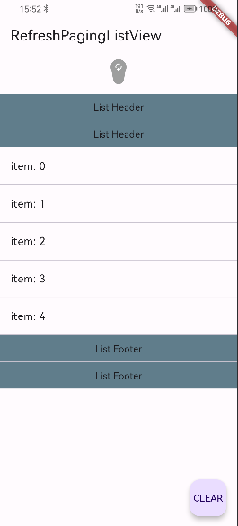
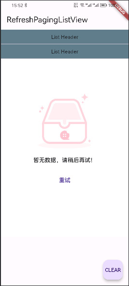

# refresh_paging_listview
<a href="https://pub.dev/packages/refresh_paging_listview">
  
</a>
<a href="https://flutter.dev/">
  
</a>
<a href="https://opensource.org/licenses/MIT">
  
</a>

## 介绍
本库在pull_to_refresh_flutter3基础上增加分页加载、设置headers、footers和空页面功能。
刷新和加载更多部分参考[flutter_pulltorefresh](https://github.com/xxzj990-game/flutter_pulltorefresh/blob/master/README.md#screenshots)

|Sample|  | 
|:---:|:---:|:---:|

## 用法
```yaml
   dependencies:

     refresh_paging_listview: ^1.3.0
```
import package

```dart
  import 'package:refresh_paging_listview/refresh_paging_listview.dart';
```
分页部分 example：

```dart
   class TaskPage extends BaseRefreshList {
     const TaskPage({super.key});

     @override
     State<TaskPage> createState() => _TaskPageState();
   }

   class _TaskPageState extends BaseRefreshListState<TaskEntity, TaskPage> {
     @override
     Widget build(BuildContext context) {
       super.build(context);
       return buildRefreshList(
           enableLoadMore: false,
           emptyConfig: EmptyConfig(...),
           headers: [
             ListHeaderItem(),
           ],
           footers: [
             ListFooterItem(),
           ],
           child: ListView.builder(
               itemBuilder: itemBuilder,
               itemCount: itemCount,
           ),
         );
     }
     
     @override
     Widget buildListItem(BuildContext context, TaskEntity item, int index) {
       return ListTile(...);
     }
     
     @override
     Future<List<TaskEntity>> loadData(int page) async {
       return [data];
     }
   }
```

全局配置RefreshConfiguration
```dart
    // 全局配置子树下的SmartRefresher,下面列举几个特别重要的属性
     RefreshConfiguration(
         headerBuilder: () => WaterDropHeader(),        // 配置默认头部指示器,假如你每个页面的头部指示器都一样的话,你需要设置这个
         footerBuilder:  () => ClassicFooter(),        // 配置默认底部指示器
         headerTriggerDistance: 80.0,        // 头部触发刷新的越界距离
         springDescription:SpringDescription(stiffness: 170, damping: 16, mass: 1.9),         // 自定义回弹动画,三个属性值意义请查询flutter api
         maxOverScrollExtent :100, //头部最大可以拖动的范围,如果发生冲出视图范围区域,请设置这个属性
         maxUnderScrollExtent:0, // 底部最大可以拖动的范围
         enableScrollWhenRefreshCompleted: true, //这个属性不兼容PageView和TabBarView,如果你特别需要TabBarView左右滑动,你需要把它设置为true
         enableLoadingWhenFailed : true, //在加载失败的状态下,用户仍然可以通过手势上拉来触发加载更多
         hideFooterWhenNotFull: false, // Viewport不满一屏时,禁用上拉加载更多功能
         enableBallisticLoad: true, // 可以通过惯性滑动触发加载更多
        child: MaterialApp(
            ........
        )
    );
```
